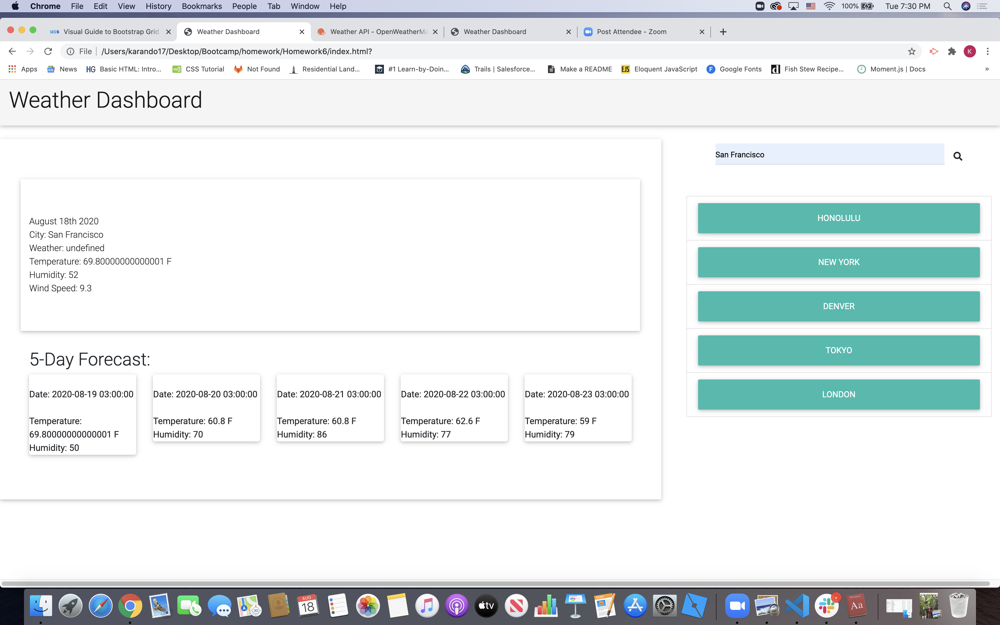

# 06 Server-Side APIs: Weather Dashboard

The following Server-Side API was used for this project: 
[OpenWeather API](https://openweathermap.org/api)
The project also requires the use of localStorage to save user searches. 


## The Project has the following acceptance criteria

```
GIVEN a weather dashboard with form inputs
WHEN I search for a city
THEN I am presented with current and future conditions for that city and that city is added to the search history
WHEN I view current weather conditions for that city
THEN I am presented with the city name, the date, an icon representation of weather conditions, the temperature, the humidity, the wind speed, and the UV index
WHEN I view the UV index
//Ternary operators here...
THEN I am presented with a color that indicates whether the conditions are favorable, moderate, or severe
WHEN I view future weather conditions for that city
THEN I am presented with a 5-day forecast that displays the date, an icon representation of weather conditions, the temperature, and the humidity
WHEN I click on a city in the search history
THEN I am again presented with current and future conditions for that city
WHEN I open the weather dashboard
THEN I am presented with the last searched city forecast
```

## Process:
MD Bootstrap was used for the initial HTML styling. 

The JS file is currently incomplete and requires further work in order to store a user's search history using localStorage.  

The app will currently allow a user to search a city and generate the current weather forecast along with a 5-day forecast.  This function is ran from line 29-105 of the app.js file. Currently, the app requires users to click on the "search icon" and will not accept an enter when a user types in a City. I plan on modifying the search form to eliminate the search icon or possibly just change the event listener.   

I initially hard coded other cities into the side buttons but realized this section was meant to store user's search history.  This function needs re-work so data is grabbed from localStorage and displayed into these buttons.  

Additionally, the app also requires a function that allows the background color of the Main City container to change color or display an icon that matches the weather conditions.  I planned to run a function using an if/else statement here.  

Lastly, the app requires CSS styling. 

This app is currently in progress and updates are being made to address the incomplete items mentioned above. 

The following image demonstrates the application functionality:




